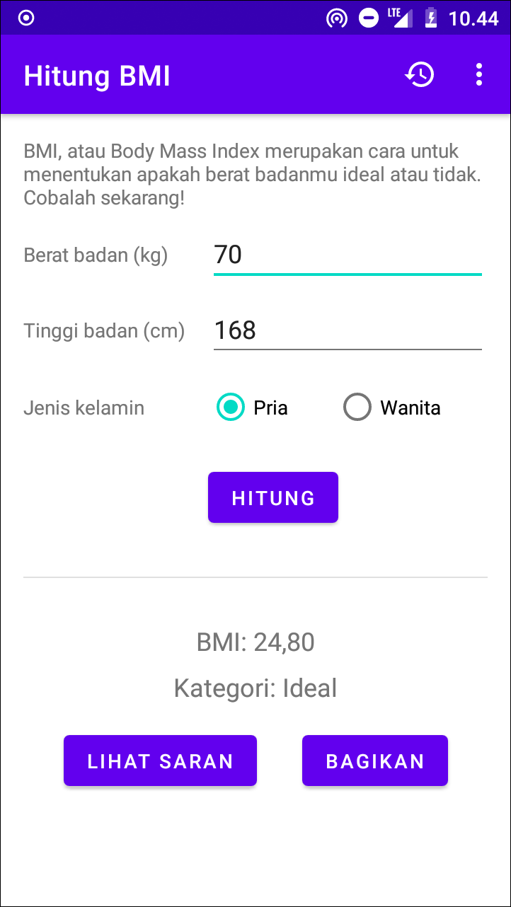
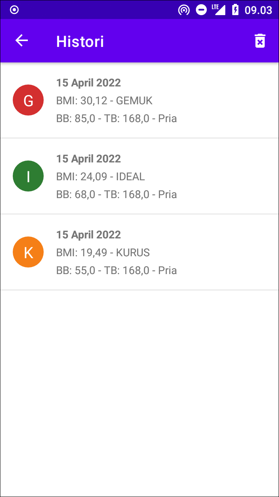

# Hitung BMI

**Repository diarsipkan** karena materi Mobpro 1 mulai Februari 2024 sudah menggunakan Jetpack Compose untuk layout, dan menggunakan studi kasus yang berbeda. Untuk melihat project terbaru, silahkan kunjungi repo [indraazimi/mobpro1-compose](https://github.com/indraazimi/mobpro1-compose) 😊

..

Aplikasi Android untuk menghitung body mass index (BMI) sehingga pengguna dapat mengetahui apakah berat badannya ideal, gemuk atau kurus.

Tampilan Utama                              | Tampilan Saran                              | Tampilan Histori
--------------------------------------------|---------------------------------------------|-----------------------------------------------
||

Punya pertanyaan atau masukan? Silahkan disampaikan melalui issue repository ini.

## Lisensi

    Copyright (c) 2021 Indra Azimi. All rights reserved.

    Dibuat untuk kelas Pemrograman untuk Perangkat Bergerak 1.
    Dilarang melakukan penggandaan dan atau komersialisasi,
    sebagian atau seluruh bagian, baik cetak maupun elektronik
    terhadap project ini tanpa izin pemilik hak cipta.
