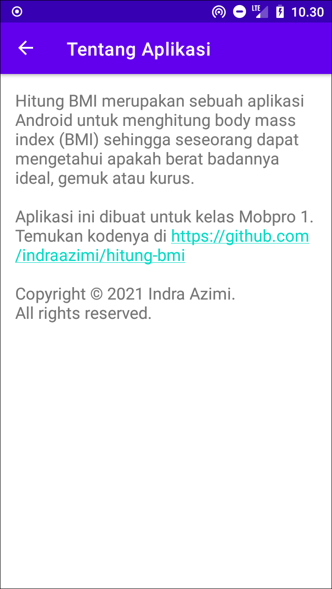

# Hitung BMI

Aplikasi Android untuk menghitung body mass index (BMI) sehingga pengguna dapat mengetahui apakah berat badannya ideal, gemuk atau kurus.

Tampilan Utama                              | Tampilan Saran                              | Tentang Aplikasi
--------------------------------------------|---------------------------------------------|---------------------------------------------
||

Punya pertanyaan atau masukan? Silahkan disampaikan melalui issue repository ini.

## Lisensi

Copyright (c) 2021 Indra Azimi. All rights reserved.

Dibuat untuk kelas Pemrograman untuk Perangkat Bergerak 1. Dilarang melakukan penggandaan dan atau komersialisasi, sebagian atau seluruh bagian, baik cetak maupun elektronik terhadap project ini tanpa izin pemilik hak cipta.